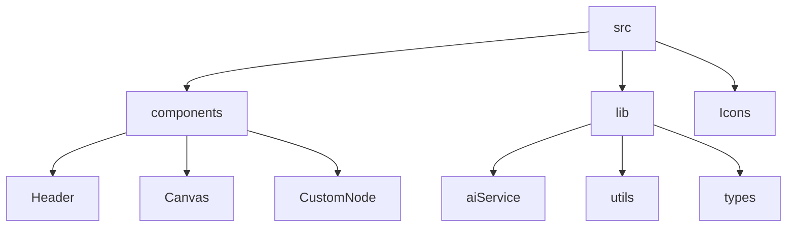

# Schema Designer

## 🗂️ Description

Schema Designer is a powerful tool for creating and managing database schemas. It provides an intuitive interface for designing, visualizing, and generating code for various database types. This project is ideal for developers, database administrators, and data analysts who need to create and manage complex database schemas.

The Schema Designer application allows users to create tables, define relationships, and generate code for popular databases such as SQL, MySQL, PostgreSQL, and MongoDB. With its AI-powered code generation feature, users can quickly create database code based on their schema definitions.

## ✨ Key Features

### **Schema Design**
* Create and manage tables with fields and relationships
* Define relationships between tables (1:1, 1:N, N:N)
* Visualize schema designs with a interactive graph

### **Code Generation**
* Generate code for popular databases (SQL, MySQL, PostgreSQL, MongoDB, etc.)
* AI-powered code generation using Google Gemini API
* Customizable code generation with user-defined requirements

### **User Interface**
* Interactive graph for visualizing schema designs
* Customizable nodes and edges for table and relationship representation
* User-friendly interface for adding and managing fields and relationships

## 🗂️ Folder Structure

## 🛠️ Tech Stack

## ⚙️ Setup Instructions

* Git clone the repository: `https://github.com/ebhay/schema-designer.git`
* Install dependencies: `pnpm install`
* Start the application: `pnpm run dev`
* Open the application in your browser: `http://localhost:5173`

## 📝 Features and Changelog

For a detailed list of features, updates, and changelog, please refer to the [FEATURES.md](FEATURES.md) file.

## 🤖 AI Service

The AI service is powered by the Google Gemini API and is used for generating database code based on schema definitions and relationships. For more information, please refer to the [aiService.ts](src/lib/aiService.ts) file.

## 🚀 GitHub Actions

This repository uses GitHub Actions for continuous integration and deployment. The workflow is defined in the `.github/workflows/main.yml` file and includes steps for building, testing, and deploying the application.

## 📁 Code Structure

The codebase is organized into the following main directories:

* `src`: The main source code directory
* `components`: Reusable UI components
* `lib`: Utility functions and libraries
* `Icons`: Icon components

Each directory has its own set of subdirectories and files, which are organized based on their functionality and purpose.

  

  
  <h3>Abhay Gupta</h3>
  
Developer passionate about breaking down complex systems to extract valuable insights and applying that knowledge to craft improved user experiences.

  

  
  <h3>Abhinandan Pratap Singh Sengar</h3>
  
Developer passionate about breaking down complex systems to extract valuable insights and applying that knowledge to craft improved user experiences.

 

    
  <a href="https://gitfull.vercel.app">Made by GitFull</a>

